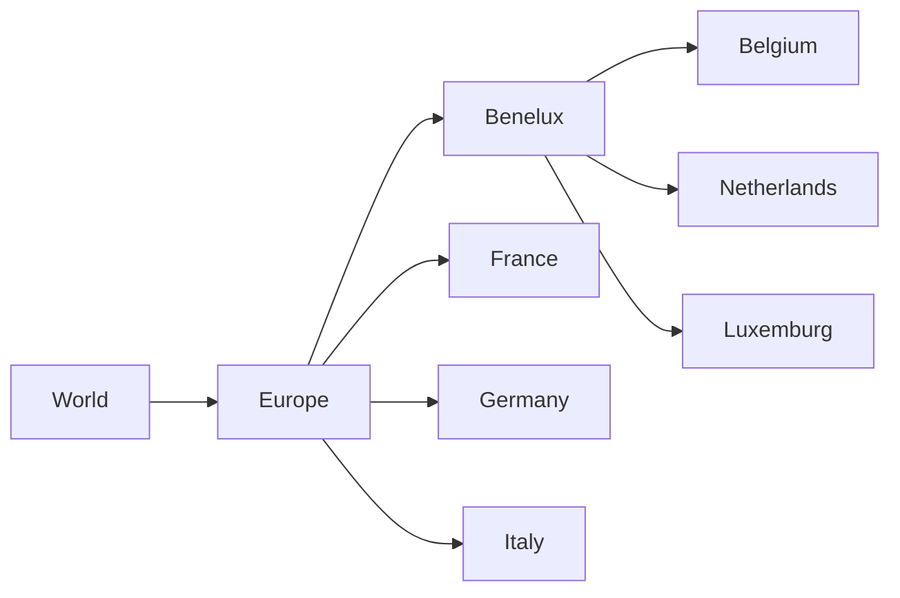
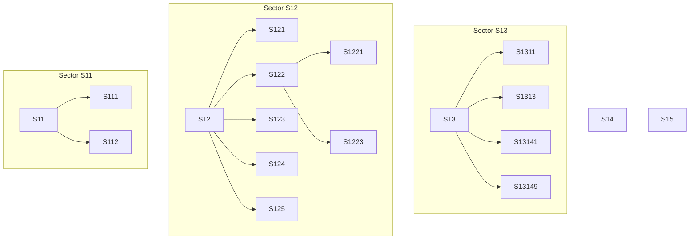
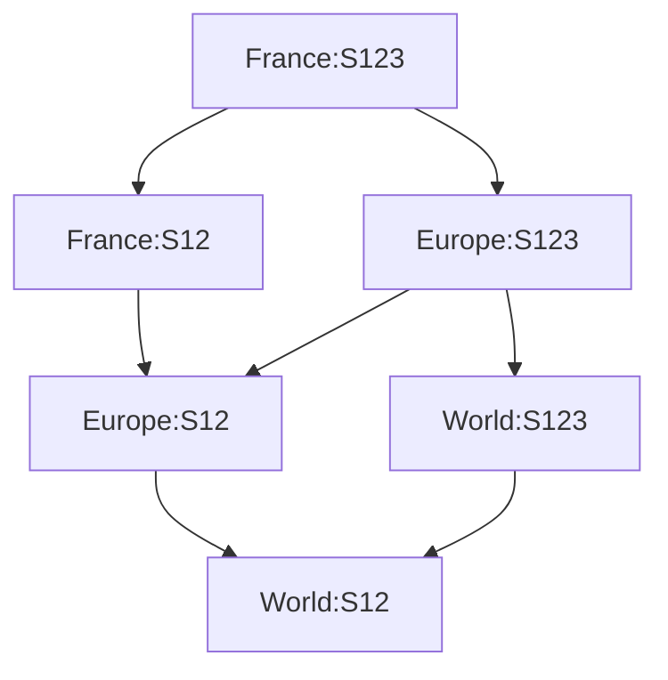

# MultiDimensionsHierarchies

[](https://www.nuget.org/packages/MultiDimensionsHierarchies/) [](https://github.com/CyLuGh/MultiDimensionsHierarchies/actions/workflows/codeql-analysis.yml) [](https://www.codefactor.io/repository/github/cylugh/multidimensionshierarchies) 

It is quite easy to do some aggregates along a single hierarchy through recursive methods. It is still easy enough with two hierarchies. But what happens when there are *n* hierarchies to iterate through? This library tries to bring an easy answer to this problem, even if it has some limitations: this won't replace a true data cube solution.

## Dimensions

The first step to solve our problem is to define the various hierarchies and the relationships between their components.

### Bones

This class represents an element in the hierarchy, with links to its parent or children if they exist. All the *Bone*s of a dimension make its *Frame*.

#### Example

Dimension ***GEO*** could be represented as such, with each country being a *Bone*.



### DimensionFactory

*Dimension*s can't be directly created. The *DimensionFactory* class offers three methods to create a dimension, which can be chosen depending on how the hierarchies are defined in input.

**A bone may have several children but can never have more than one parent.**

#### With parent link:
Each item is defined with a reference to its parent. Data could look like:
```json
[
    { id: "World" },
    { id: "Europe", parentId: "World" },
    { id: "Italy", parentId: "Europe" }
    ...
]
```

```csharp
public static Dimension BuildWithParentLink<TA, TB>(
    string dimensionName ,
    IEnumerable<TA> items ,
    Func<TA , TB> keySelector ,
    Func<TA , Option<TB>> parentKeySelector ,
    Func<TA , string> labeller = null ,
    Func<TA , double> weighter = null
    )
```
#### With single child link:
An item has a link to a single child. If there are more than one child, the item appears several times.

```json
[
    { id: "World", childId: "Europe" },
    { id: "Europe", childId: "Italy" },
    { id: "Europe", childId: "France" },
    { id: "Europe", childId: "Germany" }
    ...
]
```
```csharp
public static Dimension BuildWithChildLink<TA, TB>(
    string dimensionName ,
    IEnumerable<TA> items ,
    Func<TA , TB> keySelector ,
    Func<TA , Option<TB>> childKeySelector ,
    Func<TA , string> labeller = null )
```

#### With multiple children links:
An item defines its children in group.

```json
[
    { id: "World", children: ["Europe"] },
    { id: "Europe", children: ["Italy","France","Germany","Benelux"] },
    { id: "Benelux", children: ["Belgium","Netherlands","Luxemburg"] },
    ...
]
```
```csharp
public static Dimension BuildWithMultipleChildrenLink<TA, TB>(
    string dimensionName ,
    IEnumerable<TA> items ,
    Func<TA , TB> keySelector ,
    Func<TA , IEnumerable<TB>> childrenKeysSelector ,
    Func<TA , string> labeller = null )
```

## Skeletons

A *Skeleton*, as a collection of **n** *Bone*s, defines an entry in **n** *Dimension*s. The generic type *Skeleton\<T\>* associates an entry and a value of type T.

If we have the ***GEO*** dimension as defined earlier and we add the [Institutional ***SECTOR***](https://ec.europa.eu/eurostat/statistics-explained/index.php?title=Glossary:Institutional_sector) dimension such as:



We can then define a value for *France* and *S123* with a Skeleton like `France:S123`.

***A Skeleton can't have two dimensions with the same name.*** If for some reason, you'd need two countries definition, you'd have to create a **GEO1** and a **GEO2**.

### SkeletonFactory

As the library uses immutables to improve memory and speed, *Skeleton*s must be created through a factory.

```csharp
// Build skeletons from source items.
public static Seq<Skeleton> BuildSkeletons<T>( IEnumerable<T> inputs ,
    Func<T , string , string> parser ,
    IEnumerable<Dimension> dimensions ,
    string[] dimensionsOfInterest = null )
```

```csharp
// Build skeletons with their associated value from source items.
public static Seq<Skeleton<T>> BuildSkeletons<T, TI>( IEnumerable<TI> inputs ,
    Func<TI , string , string> parser ,
    Func<TI , T> evaluator ,
    IEnumerable<Dimension> dimensions ,
    string[] dimensionsOfInterest = null )
```

```csharp
// Build skeletons from string sources
public static Seq<Skeleton> BuildSkeletons( IEnumerable<string> stringInputs ,
    Func<string , string[]> partitioner ,
    Func<string[] , string , string> selectioner ,
    IEnumerable<Dimension> dimensions ,
    string[] dimensionsOfInterest = null )
```

## Aggregation

The *Aggregator* class offers two methods, whether the output should be limited to a defined set or not.

```csharp
public static AggregationResult<T> Aggregate<T>( Method method,
    IEnumerable<Skeleton<T>> inputs ,
    Func<T , T , T> aggregator , 
    Func<IEnumerable<T> , T> groupAggregator = null , 
    Func<T , double , T> weightEffect = null )
```

```csharp
public static AggregationResult<T> Aggregate<T>( Method method ,
    IEnumerable<Skeleton<T>> inputs ,
    Func<T , T , T> aggregator , 
    IEnumerable<Skeleton> targets , 
    Func<IEnumerable<T> , T> groupAggregator = null ,
    Func<T , double , T> weightEffect = null )
```

### Algorithms
Two algorithms (and one with two variants) are available through the *Method* enum.

#### Heuristic
The *Heuristic* algorithm will go through each input item and add its contribution to every possible ancestor.



Even with only two simple hierarchies, we can see that multiple paths can be followed through the hierarchies. The algorithm will avoid duplicate pathing.

There are three options for the *Heuristic* approach in the enum, *Heuristic*, *HeuristicGroup* and *HeuristicDictionary*. *HeuristicGroup* and *HeuristicDictionary* are only useful if you really wish to tweak the way intermediate results are stored.

The *Heuristic* method tends to be memory efficient but may less scale with multi cores processing.

#### Targeted

The *Targeted* algorithm requires a defined output set. For each target, it will find which input items are contributing and compute the result. While a little less efficient, this algorithm tends to be able to put more pressure on the CPU, making use of higher CPUs count.

## Samples
Some samples can be found in the [Demo project](https://github.com/CyLuGh/MultiDimensionsHierarchies/tree/main/src/Demo) and in the [Unit tests](https://github.com/CyLuGh/MultiDimensionsHierarchies/tree/main/src/TestMultiDimensionsHierarchies)

## Benchmarks (WIP)


| Method | Dimensions | Sample Size | Targets | Results | Duration | Speed |
|:--:|:--:|:--:|:--:|:--:|:--:|:--:|
|Heuristic|3|10,000|0|22,875|1.396s|16,386.10 r/s|
|Heuristic|3|50,000|0|32,415|4.407s|7,355.34 r/s|
|Heuristic|3|100,000|0|35,063|5.517s|6,355.44 r/s|
|Heuristic|4|10,000|0|235,423|6.407s|36,744.65 r/s|
|Heuristic|4|50,000|0|481,714|30.791s|15,644.63 r/s|
|Heuristic|4|100,000|0|615,929|59.482s|10,354.88 r/s|
|Heuristic|5|10,000|0|1,668,963|26.976s|61,868.43 r/s|
|Heuristic|5|50,000|0|4,352,390|145.394s|29,935.14 r/s|
|Targeted|3|10,000|500|500|2.158s|231.69 r/s|
|Targeted|3|50,000|500|500|7.993s|62.55 r/s|
|Targeted|3|100,000|500|500|10.525s|47.50 r/s|
|Targeted|4|10,000|500|500|2.446s|204.41 r/s|
|Targeted|4|10,000|1,000|1,000|6.741s|148.34 r/s|
|Targeted|4|10,000|5,000|5,000|31.690s|157.77 r/s|
|Targeted|4|50,000|500|500|8.216s|60.85 r/s|
|Targeted|4|50,000|1,000|1,000|39.018s|25.62 r/s|
|Targeted|4|50,000|5,000|5,000|194.676s|25.68 r/s|
|Targeted|4|100,000|500|500|11.135s|44.90 r/s|
|Targeted|4|100,000|1,000|1,000|82.293s|12.15 r/s|
|Targeted|5|10,000|1,000|1,000|6.559s|152.46 r/s|