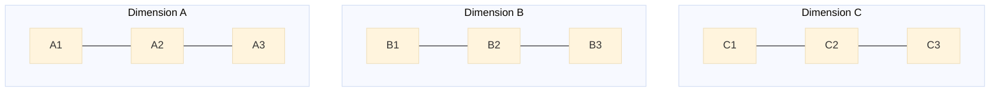
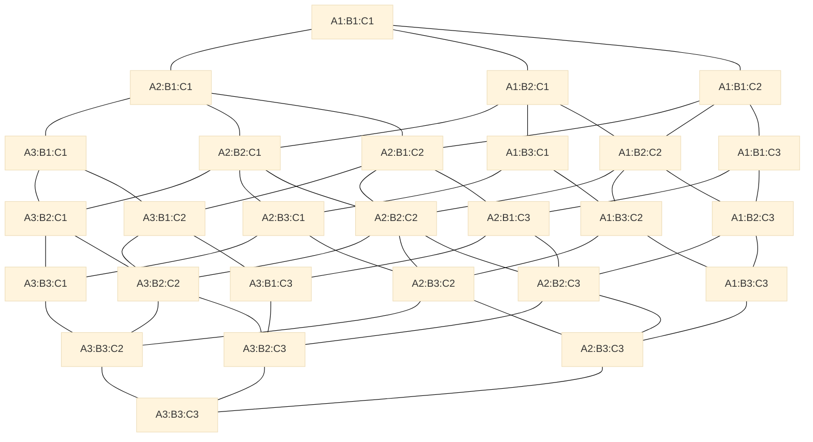
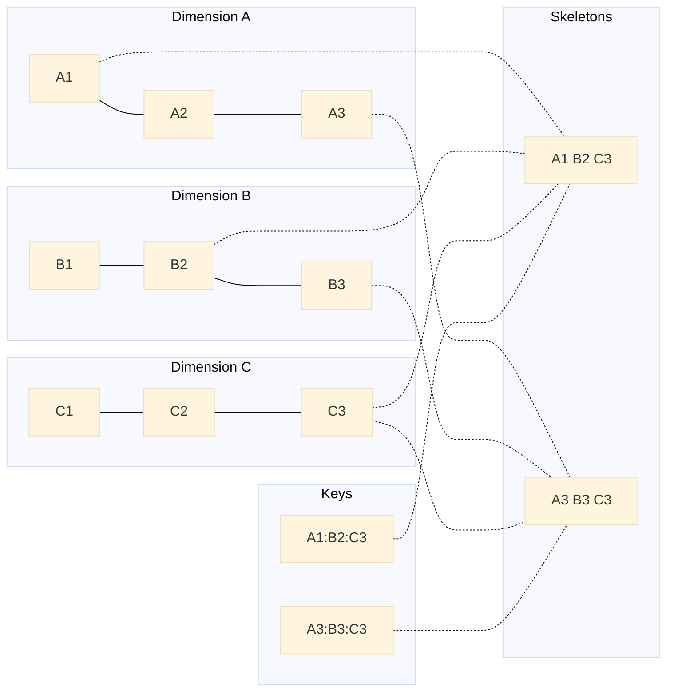
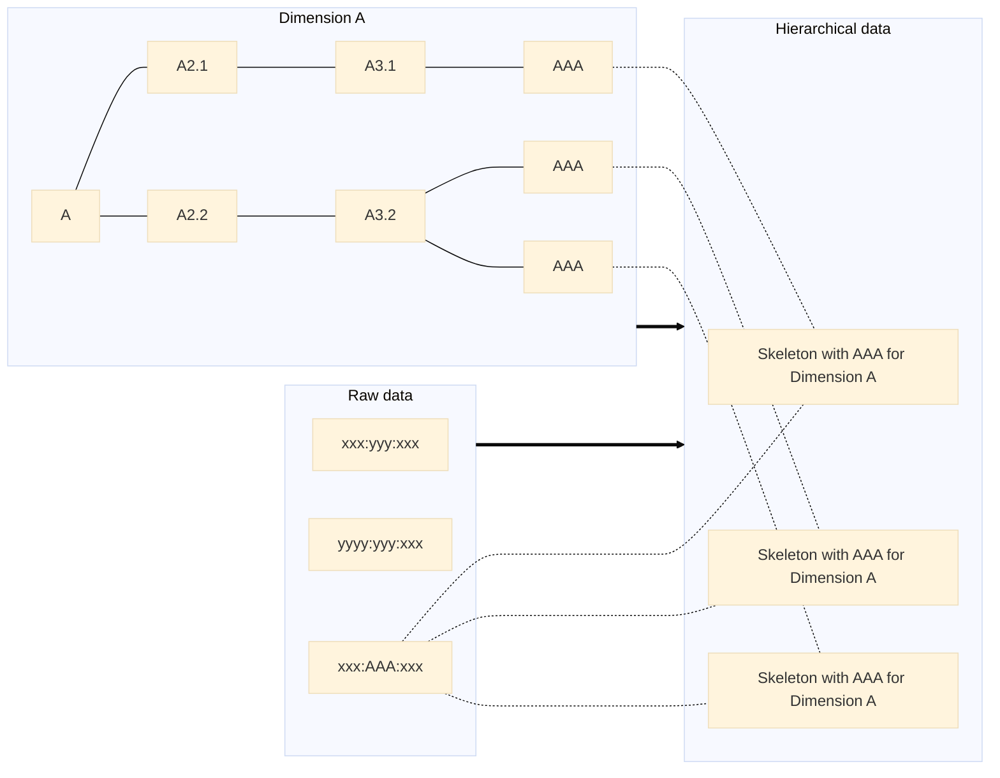

# MultiDimensionsHierarchies

   

### A rapidly growing problem

It is quite easy to do some aggregates along a single hierarchy through recursive methods. It is still easy enough with two hierarchies. But what happens when there are *n* hierarchies to iterate through?

Let's look at a simple example with three dimensions, each with a single element on three hierarchical levels.

These very simple dimensions can be combined to create $3^3 = 27$ items, which can be linked as below. This shows the complexity of going through these combinations, which will grow exponentially as dimensions are added and get more complex.

This problem will grow when we add dimensions or when this dimensions get more elements.

- If we were to add a fourth similar dimension, we'd have $3^4 = 81$ possible items. A fifth would lead us to $3^5 = 243$ elements. So, adding a dimension can have an *exponential* influence on the elements that can be found in the hierarchies.
- If we had a fourth element to our hierarchies, we get $4^3 = 64$ items. A fifth element in the hierarchies would mean $5^3 = 125$ items. Elements in hierarchies will have a *geometric* influence.

### MultiDimensionsHierarchies library

This library provides a way of handling such problem, by simplifying the way we can go through the data. It still has limitation as very complex and numerous dimensions may very well enduce very long computation or run out of memory.

#### Setting up dimensions

The first step to be able to compute aggregates is to clearly define the dimensions. The library provides several way of doing this (through **DimensionFactory**), but two informations are most important:

- the unique identifier of the item in the hierarchy
- the unique identifier of its parent in the hierarchy if it has one

Optional informations are:
- the weight of the item in its parent hierarchy, which is 1 by default.
- the label that will be used for display and input parsing, which is equal to the identifier by default.

In the library, such elements are called **Bone** and they form the **Frame** of each **Dimension**. They'll be used by reference in the following processes.

#### Identifying items in the hierarchies

By combining the **Bone** elements, each element can be identified in the hierarchies. Such combination is represented by **Skeleton** in the library. It allows to easily get descendants or ancestors of the element, as well as manipulating **Dimension** composition.

These **Skeleton**s should only be constructed through the factory pattern, as the use of direct references is essential.

!!! warning Repeating labels
- When parsing a key as string input, repeating labels will create more data.
- If the desired output reverts back to the string format, make sure that those labels are leaves or have identical descendants, otherwise the output may have wrong values as it will lose its ability to discriminate items.
!!!

#### Aggregating data

##### With a defined set of targets

With this method, the algorithm will go through each target **Skeleton** and look through the data to find composing **Skeleton** elements.

The first step will simply aggregate the items with the same key so it can limit the base data if it hasn't been optimized before the call.

The second step is to simplify the base data. If a dimension in the targets only asks for a single value, the algorithm can remove all data that don't match the requirement and then remove the dimension.

To efficiently retrieve components, each dimension is handled separately, progressively removing all elements that aren't descendants of the target. Once all non-composing elements have been removed, the aggregation method can be applied on the remaining items. By grouping the different values of the **Bone**s, the iterations on the data can be limited, which greatly improves the computation speed. 

To finalize the results, the algorithm adds back the previously removed dimensions with their single asked value.

##### Without targets

The first step will simply aggregate the items with the same key so it can limit the base data if it hasn't been optimized before the call.

The algorithm will go through each item and determine each of his ancestor items. It will add its contribution to the aggregation in a concurrent collection. Once all the data have been processed, this collection will contain the final results of the aggregation.

!!!warning  This method can rapidly create many results and see its efficiency drops as the possibilities grows exponentially.
!!!

#### Aggregation components

The algorithm has an alternative mode where it does not apply the aggregation method right away but keep tracks of the participating components. An extra parameter is then required: the list of dimensions that shouldn't be simplified to keep discrimination of components possible.

This way of using the algorithm allows the computation of derived information such as primary confidentiality.

#### Benchmarking

##### Aggregation with targets

| Dimensions | Elements in dimension | Max elements | Source items count | Target items count | Average execution time | Scaling |
| --: | --: | --: | --: | --: | --: | --: | 
| 4 | 12 | 20,736 | 10,000 | 10,000 | 676 ms | 1 |
| 4 | 12 | 20,736 | 20,000 | 10,000 | 796 ms | 1.18 |
| 4 | 12 | 20,736 | 10,000 | 20,000 | 940 ms | 1.39 |

| Dimensions | Elements in dimension | Max elements | Source items count | Target items count | Average execution time | Scaling |
| --: | --: | --: | --: | --: | --: | --: | 
| 5 | 12 | 248,832 | 10,000 | 10,000 | 1,659 ms | 1 |
| 5 | 12 | 248,832 | 10,000 | 20,000 | 2,395 ms | 1.44 |
| 5 | 12 | 248,832 | 20,000 | 10,000 | 2,850 ms | 1.71 |

| Dimensions | Elements in dimension | Max elements | Source items count | Target items count | Average execution time | Scaling |
| --: | --: | --: | --: | --: | --: | --: | 
| 6 | 12 | 2,985,984 | 10,000 | 10,000 | 2,605 ms | 1 |
| 6 | 12 | 2,985,984 | 10,000 | 20,000 | 3,891 ms | 1.49 |
| 6 | 12 | 2,985,984 | 20,000 | 10,000 | 4,616 ms | 1.77 |

| Dimensions | Elements in dimension | Max elements | Source items count | Target items count | Average execution time | Scaling |
| --: | --: | --: | --: | --: | --: | --: | 
| 6 | 12 | 2,985,984 | 100,000 | 100,000 | 48.34 s | 1 |
| 6 | 12 | 2,985,984 | 100,000 | 200,000 | 60.83 s | 1.26 |
| 6 | 12 | 2,985,984 | 200,000 | 100,000 | 81.33 s | 1.68 |

| Dimensions | Elements in dimension | Max elements | Source items count | Target items count | Average execution time | Scaling | Scaling to n-1 |
| --: | --: | --: | --: | --: | --: | --: | --: | 
| 4 | 12 | 20,736 | 10,000 | 10,000 | 676 ms | 1 | - |
| 5 | 12 | 248,832 | 10,000 | 10,000 | 1,659 ms | 2.45 | 2.45 |
| 6 | 12 | 2,985,984 | 10,000 | 10,000 | 2,605 ms | 3.85 | 1.57 |
| 7 | 12 | 35,831,808 | 10,000 | 10,000 | 3,223 ms | 4.77 | 1.23 |
| 8 | 12 | 429,981,696 | 10,000 | 10,000 | 4,594 ms | 6.80 | 1.42 |
| 9 | 12 | 5,159,780,352 | 10,000 | 10,000 | 5,931 ms | 8.77 | 1.29 |
| 10 | 12 | 61,917,364,224 | 10,000 | 10,000 | 7,580 ms | 11.21 | 1.27 |

| Dimensions | Elements in dimension | Max elements | Source items count | Target items count | Average execution time | Scaling |
| --: | --: | --: | --: | --: | --: | --: | 
| 4 | 251 | 3,969,126,001 | 10,000 | 10,000 | 2,277 ms | 1 |
| 4 | 251 | 3,969,126,001 | 10,000 | 20,000 | 3,466 ms | 1.52 |
| 4 | 251 | 3,969,126,001 | 20,000 | 10,000 | 4,626 ms | 2.04 |

| Dimensions | Elements in dimension | Max elements | Source items count | Target items count | Average execution time | Scaling |
| --: | --: | --: | --: | --: | --: | --: | 
| 5 | 251 | 996,250,626,251 | 10,000 | 10,000 | 3,689 ms | 1 |
| 5 | 251 | 996,250,626,251 | 10,000 | 20,000 | 5,260 ms | 1.42 |
| 5 | 251 | 996,250,626,251 | 20,000 | 10,000 | 6,365 ms | 1.72 |

We can see the volume of source data has more influence on performance than the number of targets to be computed. Both still are below a linear influence, as even if we double the amount of items, we almost never double the execution time.  These tests are also a worst case scenario: data are randomly generated and should be equally dispersed in the dimensions. In a real world case, data are often unbalanced, which make the algorithm more efficient.