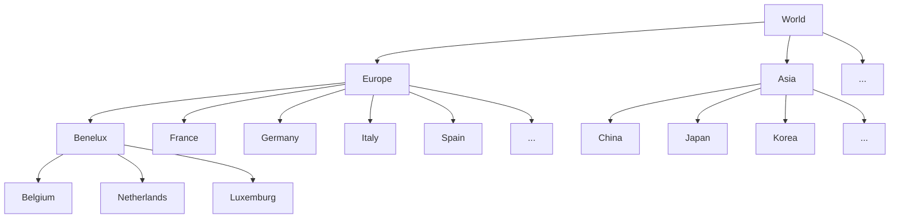
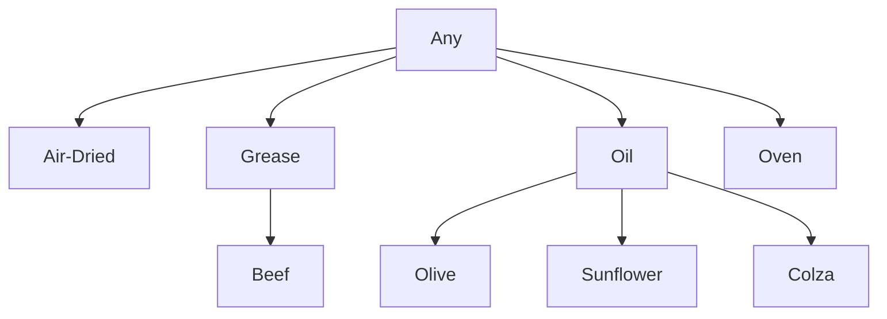
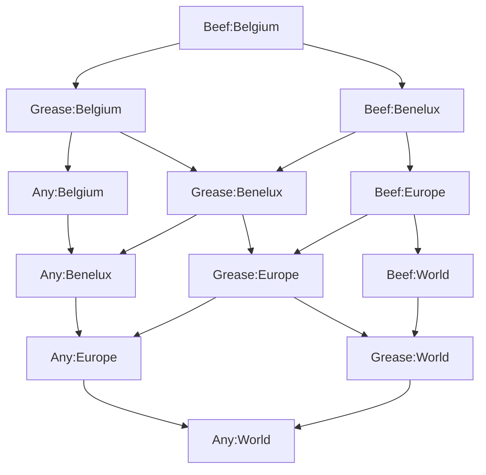

# MultiDimensionsHierarchies

[](https://www.nuget.org/packages/MultiDimensionsHierarchies/) [](https://github.com/CyLuGh/MultiDimensionsHierarchies/actions/workflows/codeql-analysis.yml) [](https://www.codefactor.io/repository/github/cylugh/multidimensionshierarchies) 

It is quite easy to do some aggregates along a single hierarchy through recursive methods. It is still easy enough with two hierarchies. But what happens when there are *n* hierarchies to iterate through? This library tries to bring an easy answer to this problem, even if it has some limitations: this won't replace a true data cube solution.

## Dimensions

The first step to solve our problem is to define the various hierarchies and the relationships between their components.

### Bones

This class represents an element in the hierarchy, with links to its parent or children if they exist. All the *Bone*s of a dimension make its *Frame*.

#### Example

All along these examples, we'll talk about fries. We could imagine several dimensions about them: where the potatoes have been grown, where the fries have been eaten, how they were cooked, which shape they were cut into, whether they were fresh or frozen...

Dimension ***GEO*** could be represented as such, with each country being a *Bone*.



Dimension ***COOKING*** could look like this:



### DimensionFactory

*Dimension*s can't be directly created. The *DimensionFactory* class offers three methods to create a dimension, which can be chosen depending on how the hierarchies are defined in input.

**A bone may have several children but can never have more than one parent.**

#### With parent link:
Each item is defined with a reference to its parent. Data could look like:
```json
[
    { id: "World" },
    { id: "Europe", parentId: "World" },
    { id: "Italy", parentId: "Europe" }
    ...
]
```

```csharp
public static Dimension BuildWithParentLink<TA, TB>(
    string dimensionName ,
    IEnumerable<TA> items ,
    Func<TA , TB> keySelector ,
    Func<TA , Option<TB>> parentKeySelector ,
    Func<TA , string> labeller = null ,
    Func<TA , double> weighter = null
    )
```

- `Func<TA , string> labeller` will determine the *Bone* label. If not provided, it will be use the key `ToString()` method.
- `Func<TA , double> weighter` can set a weight to be applied on the child contribution when computing the parent aggregate. If not set, the weight will be **1**, which means the child value is unaffected.


#### With single child link:
An item has a link to a single child. If there are more than one child, the item appears several times.

```json
[
    { id: "World", childId: "Europe" },
    { id: "Europe", childId: "Italy" },
    { id: "Europe", childId: "France" },
    { id: "Europe", childId: "Germany" }
    ...
]
```

```csharp
public static Dimension BuildWithChildLink<TA, TB>(
    string dimensionName ,
    IEnumerable<TA> items ,
    Func<TA , TB> keySelector ,
    Func<TA , Option<TB>> childKeySelector ,
    Func<TA , string> labeller = null )
```

#### With multiple children links:
An item defines its children in group.

```json
[
    { id: "World", children: ["Europe"] },
    { id: "Europe", children: ["Italy","France","Germany","Benelux"] },
    { id: "Benelux", children: ["Belgium","Netherlands","Luxemburg"] },
    ...
]
```

```csharp
public static Dimension BuildWithMultipleChildrenLink<TA, TB>(
    string dimensionName ,
    IEnumerable<TA> items ,
    Func<TA , TB> keySelector ,
    Func<TA , IEnumerable<TB>> childrenKeysSelector ,
    Func<TA , string> labeller = null )
```

## Skeletons

A *Skeleton*, as a collection of **n** *Bone*s, defines an entry in **n** *Dimension*s. The generic type *Skeleton\<T\>* associates an entry and a value of type T.

If we wished to identify the fries produced in Belgium and cooked properly, we'd have `Belgium` for the **GEO** dimension and `Beef` for the **COOKING** dimension. The resulting skeleton would look like `Beef:Belgium`. **Inside a *Skeleton*, the *Bones* are sorted by the alphabetical order of their *Dimension* name.**

***A Skeleton can't have two dimensions with the same name.*** If for some reason, we'd need two countries definition, you'd have to create a **GEO1** and a **GEO2**, or be more explicit with **PRODUCTION_COUNTRY** and **CONSUMPTION_COUNTRY**.

### SkeletonFactory

As the library uses immutables to improve memory and speed, *Skeleton*s must be created through a factory.

```csharp
// Build skeletons from source items.
public static Seq<Skeleton> BuildSkeletons<T>( IEnumerable<T> inputs ,
    Func<T , string , string> parser ,
    IEnumerable<Dimension> dimensions ,
    string[] dimensionsOfInterest = null )
```

```csharp
// Build skeletons with their associated value from source items.
public static Seq<Skeleton<T>> BuildSkeletons<T, TI>( IEnumerable<TI> inputs ,
    Func<TI , string , string> parser ,
    Func<TI , T> evaluator ,
    IEnumerable<Dimension> dimensions ,
    string[] dimensionsOfInterest = null )
```

```csharp
// Build skeletons from string sources
public static Seq<Skeleton> BuildSkeletons( IEnumerable<string> stringInputs ,
    Func<string , string[]> partitioner ,
    Func<string[] , string , string> selectioner ,
    IEnumerable<Dimension> dimensions ,
    string[] dimensionsOfInterest = null )
```

## Aggregation

The *Aggregator* class offers two methods, whether the output should be limited to a defined set or not.

```csharp
public static AggregationResult<T> Aggregate<T>( Method method,
    IEnumerable<Skeleton<T>> inputs ,
    Func<T , T , T> aggregator , 
    Func<IEnumerable<T> , T> groupAggregator = null , 
    Func<T , double , T> weightEffect = null )
```

```csharp
public static AggregationResult<T> Aggregate<T>( Method method ,
    IEnumerable<Skeleton<T>> inputs ,
    Func<T , T , T> aggregator , 
    IEnumerable<Skeleton> targets , 
    Func<IEnumerable<T> , T> groupAggregator = null ,
    Func<T , double , T> weightEffect = null )
```

### Algorithms
Two algorithms are available through the *Method* enum.

#### BottomTop
The *BottomTop* algorithm will go through each input item and add its contribution to every possible ancestor.



Even with only two simple hierarchies, we can see that multiple paths can be followed through the hierarchies. The algorithm will avoid duplicate pathing.

Several variants are available for this algorithm:
- **BottomTopGroup**: the algorithm will use the *GroupBy* operator from *Linq* to go through the nodes, which is faster but needs more memory. The required memory will also be more affected by the size of input data.
- **BottomTopDictionary**: the algorithm will go through the nodes and use a *ConcurrentDictionary* to store the results. This requires a lot less memory, but it tends to be half as fast as the other method, because of the threading synchronization happening on the dictionary.
- **BottomTopGroupCached** and **BottomTopDictionaryCached**: they implement the same algorithm as previously described but use another *ConcurrentDictionary* to reuse some previously computed nodes. This is faster as long as the computed nodes remain below 1,500,000 items.

The **BottomTop** method tends to be memory efficient but may less scale with multi cores processing.

#### TopDown

The *TopDown* algorithm requires a defined output set. For each target, it will find which input items are contributing and compute the result. While a little less efficient, this algorithm tends to be able to put more pressure on the CPU, making use of higher CPUs count.

## Samples
Some samples can be found in the [Demo project](https://github.com/CyLuGh/MultiDimensionsHierarchies/tree/main/src/Demo) and in the [Unit tests](https://github.com/CyLuGh/MultiDimensionsHierarchies/tree/main/src/TestMultiDimensionsHierarchies)

## Benchmarks (WIP) -- Outdated by new implementations


| TargetsCount | AggregationMethod | SampleSize | DimensionsCount | Mean | Allocated |
| --: | --: | --: | --: | --: | --: |
| 1000 | TopDown | 100000 | 4 | 50,7 | 41.07 GB
| 1000 | TopDown | 100000 | 5 | 49,24 | 41.38 GB
| 1000 | TopDown | 200000 | 4 | 94,01 | 78.37 GB
| 1000 | TopDown | 200000 | 5 | 93,83 | 79.11 GB
| 1000 | TopDownGroup | 100000 | 4	| 11,5 | 5.84 GB
| 1000 | TopDownGroup | 100000 | 5	| 12,11 | 6.23 GB
| 1000 | TopDownGroup | 200000 | 4	| 24,23 | 11.25 GB
| 1000 | TopDownGroup | 200000 | 5	| 25,03 | 12 GB
| 2000 | TopDown | 100000 | 4 | 78,55| 67.11 GB
| 2000 | TopDown | 100000 | 5 | 83,69| 67.5 GB
| 2000 | TopDown | 200000 | 4 | 148,01| 128.5 GB
| 2000 | TopDown | 200000 | 5 | 147,26| 129.15 GB
| 2000 | TopDownGroup | 100000 | 4 | 12,94 | 7.25 GB
| 2000 | TopDownGroup | 100000 | 5 | 14 | 7.63 GB
| 2000 | TopDownGroup | 200000 | 4 | 25,97 | 13.89 GB
| 2000 | TopDownGroup | 200000 | 5 | 27,9 | 14.68 GB
